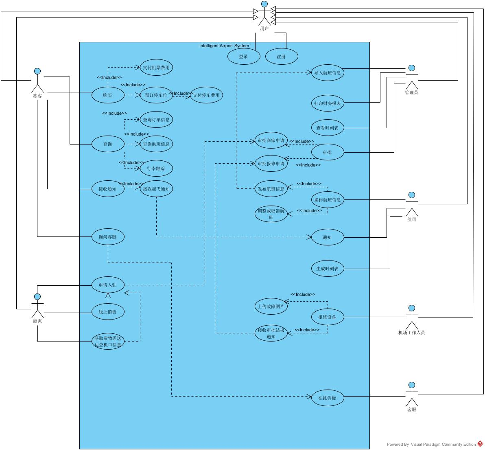
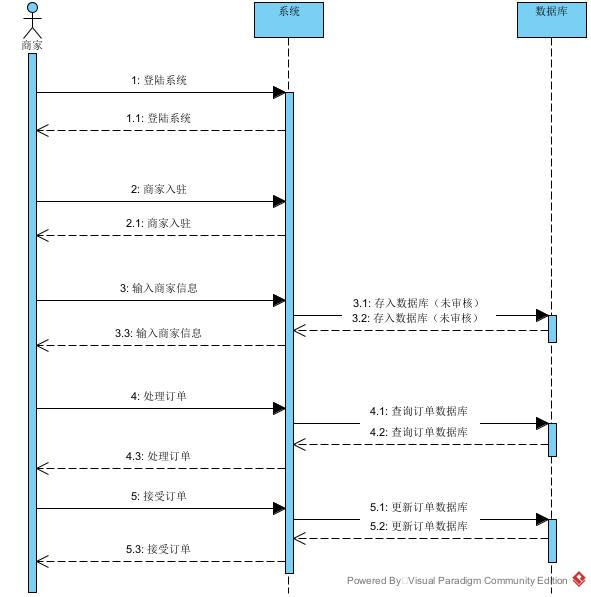
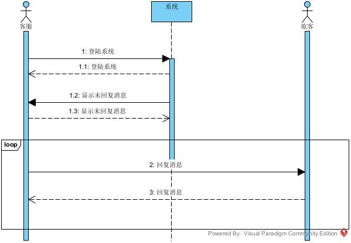
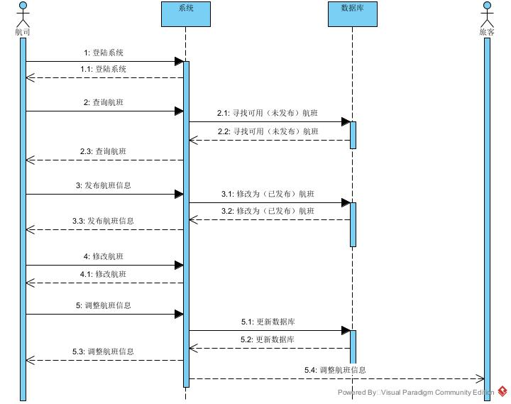
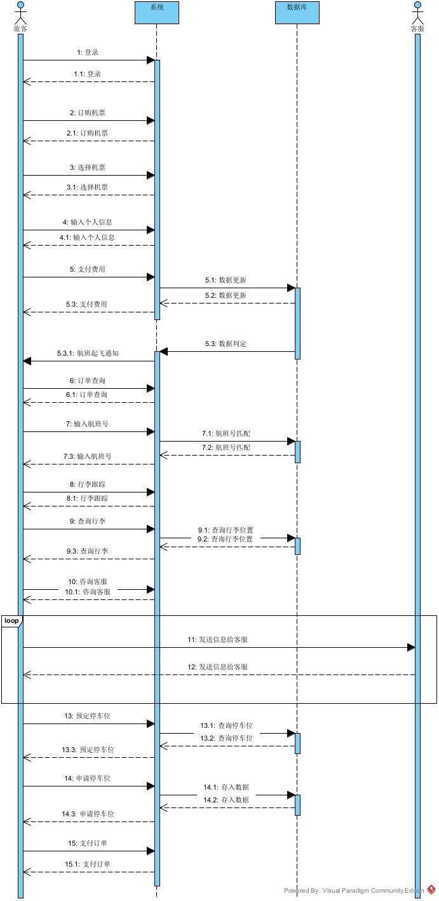
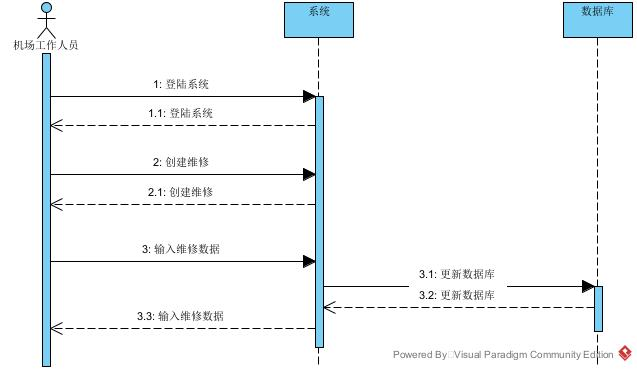
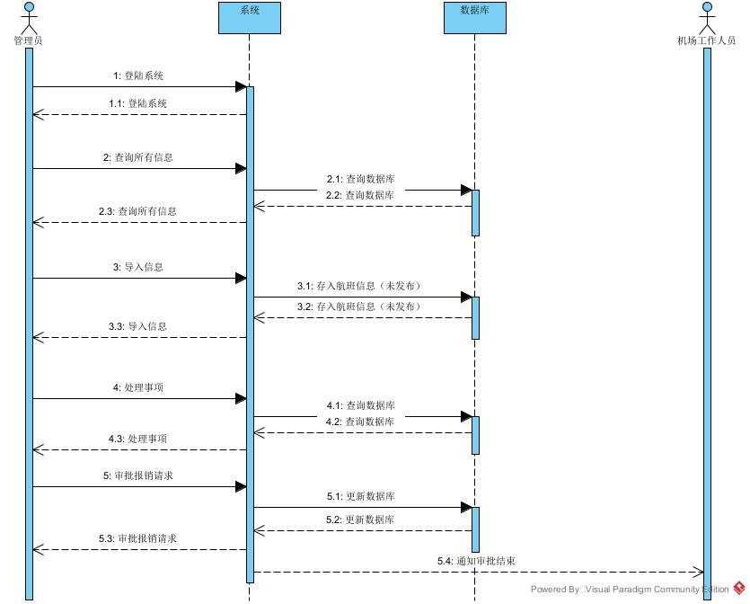

# 一．需求分析

## 用户身份：

- 管理者
- 航司
- 旅客
- 商家
- 机场工作人员
- 客服

## 1、航司发布航班信息的用户故事：

作为一名航司，我希望能够：

- 在系统上发布航班信息，包括价格、起飞日期时间、航班号等
- 由系统生成包括具体登机口信息的时刻表
- 为旅客提供机票的查询和购买服务
- 通过系统进行航班价格调整或取消操作
- 及时通知旅客

## 2、旅客查询机票信息的用户故事：

作为一名旅客，我希望能够：

- 在系统上查询订票信息是否成功、生成电子机票等
- 得知具体的登机口和航站楼信息
- 在临近起飞时收到起飞通知
- 通过系统提供的行李跟踪功能查询行李位置和状态

## 3、机场工作人员保修设备的用户故事：

作为一名机场工作人员，我希望能够：

- 在系统上报修设备和设施，上传相应的图片
- 收到管理员的批准信息
- 及时修复故障，维护机场的正常运营

## 4、管理者管理机场的用户故事：

作为一名机场管理者，我希望能够：

- 获取机票的销售信息，以便在系统上打印财务报表、查看航班时刻表，批量导入航班信息
- 获取来自工作人员的保修信息并处理，来维护机场的正常运行

## 5、商家入驻机场的用户故事：

作为一名商家，我希望能够：

- 在系统上申请入驻机场系统
- 在线上销售产品，发布我的产品信息
- 获取货物需送达的登机口信息
- 获取我的最大利益

## 6、客服回答旅客问题的用户故事：

作为一名客服，我希望能够：

- 获取来自用户的询问信息
- 实时在线回答
- 为用户提供更好的体验

## 7、旅客询问客服的用户故事：

作为一名旅客，我希望能够：

- 在线向客服询问问题
- 解答我的疑惑
  （可以在客服设置一下常见问题的标准回答）

## 8、旅客预订停车位的用户故事：

作为一名旅客，我希望能够：

- 在系统上预订停车位
- 在线支付费用
- 停放我的车辆。

# 二. 交互流程

## 1、航司发布航班信息的用户故事交互流程

### 基本流程

{

1. （用户）航司登录系统
2. （系统）系统跳转到处理航班信息界面
3. （用户）航司点击“查询”，查询管理员导入的可用航班
4. （系统）系统从数据库中获取可用航班信息，列出航班信息
5. （用户）航司输入航班信息，包括价格、起飞日期时间、航班号，点击“发布”按钮
6. （系统）系统处理航班信息，将数据传输到数据库，生成时刻表，将这些发布的航班信息状态设置为已发布
7. （用户）航司退出系统，操作结束
   }

### 扩展流程

（可选）3a、航司可以调整航班信息或者取消航班

1. （用户）航司点击已有航班的“调整”按钮
2. （系统）系统跳转到航班信息的修改界面
3. （用户）航司修改航班信息，并点击“保存”按钮
4. （系统）系统更新航司所修改的信息，生成新的时刻表，并更新数据库，同时发布通知给乘客

## 2、旅客查询机票信息的用户故事交互流程

### 基本流程

{
（用户）1.旅客登录系统
（系统）2.系统跳转到主页
（用户）3.旅客点击“订购机票”按钮
（系统）4.系统跳转到订购机票页面，展示可以订购的飞机列表
（用户）5.旅客选择所需要的机票，输入个人信息
（系统）6.跳转到支付界面
（用户）7.旅客支付机票费用
（系统）8.系统将旅客购票信息更新到数据库中，并生成电子机票
}

### 扩展流程

{
（可选）2-6a、乘客接收起飞通知

（系统）1.系统在航班临近起飞，向该航班的乘客发送信息
（用户）2.乘客接收通知新消息

（可选）2-6b、乘客选择查询机票是否订购成功
（用户）1.乘客点击“订单查询”按钮
（系统）2.系统跳转到订单查询界面
（用户）3.用户输入自己电子车票的航班号
（系统）4.系统接收用户输入的航班号，在数据库中查找对于航班，是否存在该乘客，返回该乘客的订票信息
（用户）5.旅客查看查询结果

（可选）2-6c、乘客选择跟踪行李

（用户）1.旅客点击“行李跟踪”按钮
（系统）2.系统跳转到行李跟踪界面
（用户）3.旅客点击“查询”按钮
（系统）4.系统由数据库查询旅客行李的位置和状态
}

## 3、机场工作人员保修设备的用户故事交互流程

### 基本流程

{
（用户）1.机场工作人员登录系统
（系统）2.系统跳转到报修
（用户）3.机场工作人员点击“创建”按钮，输入故障位置、原因、上传故障图片
（系统）4.系统将故障数据传入数据库中，创建故障表单，显示故障审批状态
}

## 4、管理者管理机场的用户故事的交互流程：

### 基本流程

{
（用户）1.管理员登录系统
（系统）2.系统跳转到管理界面
（用户）3.管理员点击“查询”按钮，查询所有信息
（系统）4.系统从数据库中获取数据，按照航班号生成销售表，生成时刻表，生成财务报表
（用户）5.管理员点击“导入”按钮，批量导入可用航班信息
（系统）6.系统接收信息，存入数据库中，将航班信息状态设置为未发布
}

### 扩展流程

2-6a. （可选）管理员选择处理报修事务

（用户）1.管理员点击“处理事项”按钮
（系统）2.系统跳转到事项处理界面，显示所有机场工作人员提交的故障表单
（用户）3.管理员审批报修请求
（系统）4.系统更新数据库中对应故障号的状态，并向申请的机场工作人员发送审批结束通知

## 5、商家入驻机场的用户故事的交互流程：

### 基本流程

{
（用户）1、商家登录系统
（系统）2、系统跳转到系统主页（和旅客一样）
（用户）3、商家点击“商家入驻”按钮
（系统）4、系统跳转到商家入驻界面
（用户）5、商家输入自己店铺信息，点击“提交”按钮提交信息
（系统）6、系统接收商家的店铺信息，存到数据库中，状态设置为“未审核”
}

### 扩展流程

{
（可选）5a、商家可以选择处理订单
（用户）1、商家点击“处理订单”按钮
（系统）2、系统跳转到订单界面，显示已有订单，包括商品数量、需送达的登机口信息
（用户）3、商家点击“接受”按钮，接受订单
}

## 6、客服回答旅客问题的用户故事交互流程：

### 基本流程

{
（用户）1、客服登录系统
（系统）2、系统跳转到客服服务界面，显示未处理消息列表
（用户）3、客服点击未回复消息列表
（系统）4、跳转到聊天界面
（用户）5、客服开始在线聊天
}

## 7、旅客询问客服的用户故事的交互流程：

### 基本流程

{
（用户）1、旅客登录系统
（系统）2、系统跳转到主页
（用户）3、旅客点击客服按钮
（系统）4、系统跳转到聊天页面
（用户）5、旅客开始在线聊天，向客服发送问题
}

## 8、旅客预订停车位的用户故事的交互流程：

### 基本流程

{
（用户）1、旅客登录系统
（系统）2、系统跳转到主页
（用户）3、旅客点击“预订停车位”按钮
（系统）4、系统跳转到停车位预订界面，展示可用停车位时间段、价格、数量
（用户）5、旅客点击想要的停车位，输入停车时间段
（系统）6、系统接收旅客信息，跳转到支付界面
（用户）7、旅客完成支付，预订停车位完成
}

# 三. 用例图

# 四.系统顺序图

# 五. 概念类图

# 六. 系统操作合约
**航司类 (Airline)** 
- 属性：
  - name (航司名称)
  - flights (航班列表)
- 方法：
  - login() (登录系统)
  - publish_flight(flight_info) (发布航班信息)
  - adjust_flight(flight_id, new_info) (调整航班信息)
  - cancel_flight(flight_id) (取消航班)

**机场工作人员类 (AirportStaff)**
- 属性：
  - name (姓名)
  - repair_requests (报修请求列表)
- 方法：
  - submit_repair_request(repair_info) (提交报修请求)

**管理者类 (Administrator)**
- 属性：
  - name (姓名)
- 方法:
  - import_flights(flight_info_list) (批量导入航班信息)
  - view_sales_report() (查看销售报表)
  - view_timetable() (查看时刻表)
  - view_financial_report() (查看财务报表)
  - handle_repair_request(repair_request_id) (处理报修请求)
  - handle_store_application(application_id) (处理商家入驻申请)

**商家类 (Merchant)** 
- 属性：
  - name (店铺名称)
  - products (产品列表)
  - orders (订单列表)
- 方法：
  - apply_for_store(store_info) (申请入驻机场)
  - add_product(product_info) (添加产品信息)
  - process_order(order_id) (处理订单)

**客服类 (CustomerService)** 
- 属性：
  - name (姓名)
- 方法：
  - answer_question(question) (回答旅客问题)

**停车位预订类 (ParkingReservation)** 
- 属性：
  - passenger (旅客)
  - parking_space (停车位)
  - time_range (预订时间段)
  - payment_status (支付状态)
- 方法：
  - book_parking_space(parking_space_id, time_range) (预订停车位)
  - pay_for_reservation(reservation_id) (支付预订费用)

**航司类**

#login

- 操作签名：login()
- 交叉引用：无
- 前置条件：用户已注册
- 后置条件：无

#register

- 操作签名：register()
- 交叉引用：无
- 前置条件：无
- 后置条件：无

#publish_flight(flight_info) (发布航班信息)

- 操作签名：publish_flight(flight_info)
- 交叉引用：导入航班信息
- 前置条件：无
- 后置条件：发送航班信息给管理员

#adjust_flight(flight_id, new_info) (调整航班信息)

- 操作签名：adjust_flight(flight_id, new_info)
- 交叉引用：操作航班信息
- 前置条件：无
- 后置条件：无

#cancel_flight(flight_id) (取消航班)

- 操作签名：cancel_flight(flight_id)
- 交叉引用：操作航班信息
- 前置条件：无
- 后置条件：无

**旅客类**

#login

- 操作签名：login()
- 交叉引用：无
- 前置条件：用户已注册
- 后置条件：无

#register

- 操作签名：register()
- 交叉引用：无
- 前置条件：无
- 后置条件：无

#search_flights(criteria) (查询航班)

- 操作签名：search_flights(criteria)
- 交叉引用：查询
- 前置条件：航班存在
- 后置条件：输出航班信息

#book_flight(flight_id, passenger_info) (订购机票)

- 操作签名：book_flight(flight_id, passenger_info)
- 交叉引用：购买
- 前置条件：该航班机票未售尽
- 后置条件：预定航班列表增加信息

#receive_departure_notification() (接收起飞通知)

- 操作签名：receive_departure_notification()
- 交叉引用：通知
- 前置条件：用户已购买机票
- 后置条件：无

#check_booking_status(booking_id) (查询订票状态)

- 操作签名：check_booking_status(booking_id)
- 交叉引用：查询
- 前置条件：无
- 后置条件：无

#track_luggage(luggage_id) (行李跟踪)

- 操作签名：track_luggage(luggage_id)
- 交叉引用：查询
- 前置条件：用户已购买机票
- 后置条件：无

**机场工作人员类**

#login

- 操作签名：login()
- 交叉引用：无
- 前置条件：用户已注册
- 后置条件：无

#register

- 操作签名：register()
- 交叉引用：无
- 前置条件：无
- 后置条件：无

#submit_repair_request(repair_info) (提交报修请求)

- 操作签名：submit_repair_request(repair_info)
- 交叉引用：审批
- 前置条件：无
- 后置条件：发送信息给管理员审批

**管理者类**

#login

- 操作签名：login()
- 交叉引用：无
- 前置条件：用户已注册
- 后置条件：无

#register

- 操作签名：register()
- 交叉引用：无
- 前置条件：无
- 后置条件：无

#import_flights(flight_info_list) (批量导入航班信息)

- 操作签名：import_flights(flight_info_list)
- 交叉引用：发布航班信息
- 前置条件：航班存在
- 后置条件：无

#view_sales_report() (查看销售报表)

- 操作签名：view_sales_report()
- 交叉引用：查询
- 前置条件：无
- 后置条件：无

#view_timetable() (查看时刻表)

- 操作签名：view_timetable()
- 交叉引用：查询
- 前置条件：无
- 后置条件：无

#view_financial_report() (查看财务报表)

- 操作签名：view_financial_report()
- 交叉引用：查询
- 前置条件：无
- 后置条件：无

#handle_repair_request(repair_request_id) (处理报修请求)

- 操作签名：handle_repair_request(repair_request_id)
- 交叉引用：审批
- 前置条件：获得报修请求
- 后置条件：发送报修信息

#handle_store_application(application_id) (处理商家入驻申请)

- 操作签名：handle_store_application(application_id)
- 交叉引用：审批
- 前置条件：获得商家入驻申请
- 后置条件：发送商家入驻申请

**商家类**

#login

- 操作签名：login()
- 交叉引用：无
- 前置条件：用户已注册
- 后置条件：无

#register

- 操作签名：register()
- 交叉引用：无
- 前置条件：无
- 后置条件：无

#apply_for_store(store_info) (申请入驻机场)

- 操作签名：apply_for_store(store_info)
- 交叉引用：无
- 前置条件：无
- 后置条件：无

#add_product(product_info) (添加产品信息)

- 操作签名：add_product(product_info)
- 交叉引用：销售
- 前置条件：无
- 后置条件：产品列表更新信息

#process_order(order_id) (处理订单)

- 操作签名：process_order(order_id)
- 交叉引用：销售
- 前置条件：无
- 后置条件：订单列表更新

**客服类**

#login

- 操作签名：login()
- 交叉引用：无
- 前置条件：用户已注册
- 后置条件：无

#register

- 操作签名：register()
- 交叉引用：无
- 前置条件：无
- 后置条件：无

#answer_question(question) (回答旅客问题)

- 操作签名：answer_question(question)
- 交叉引用：询问客服
- 前置条件：无
- 后置条件：无

**停车位预订类**

#book_parking_space(parking_space_id, time_range) (预订停车位)

- 操作签名：book_parking_space(parking_space_id, time_range)
- 交叉引用：购买
- 前置条件：停车位有预留
- 后置条件：更新停车位信息

#pay_for_reservation(reservation_id) (支付预订费用)

- 操作签名：pay_for_reservation(reservation_id)
- 交叉引用：购买
- 前置条件：预定订单生效
- 后置条件：更新支付状态
